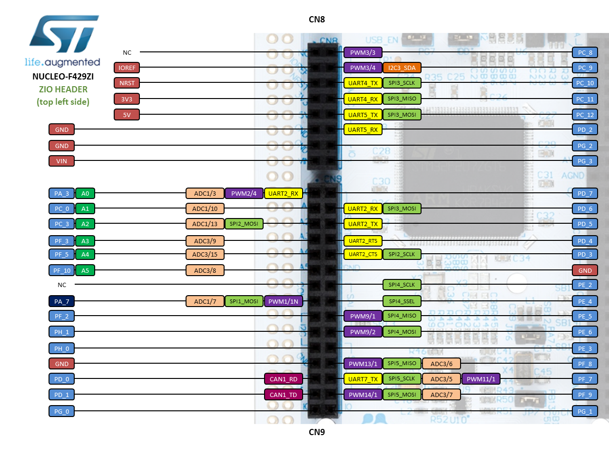
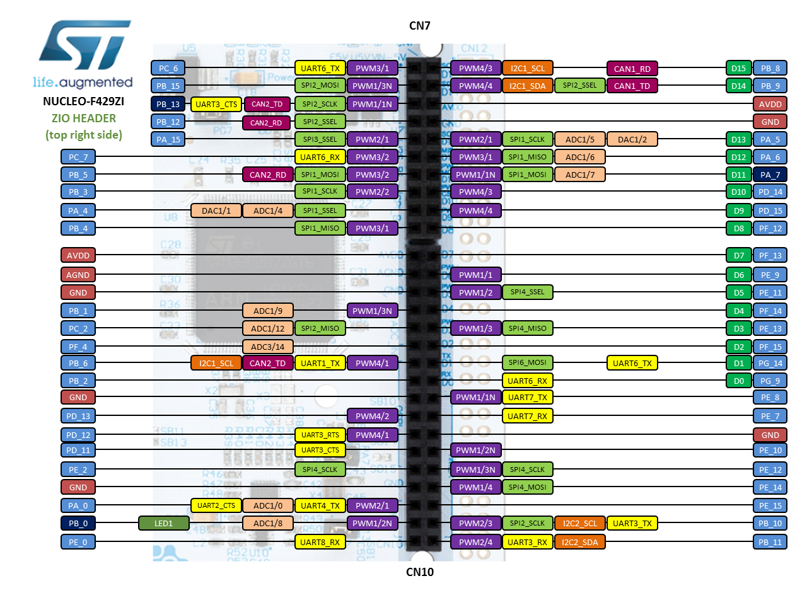
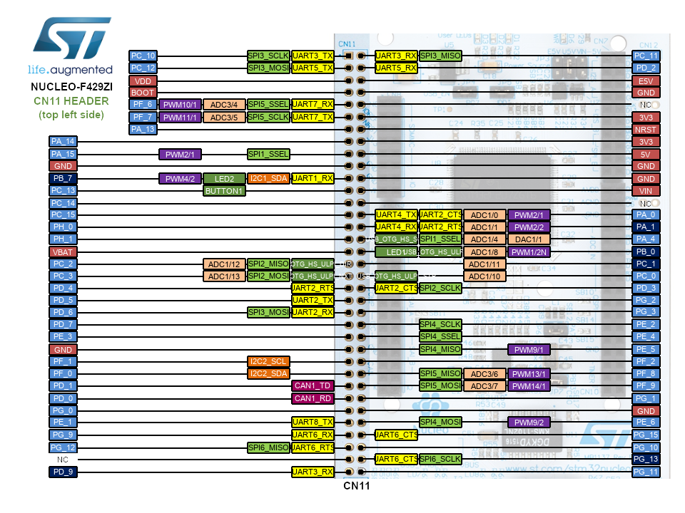
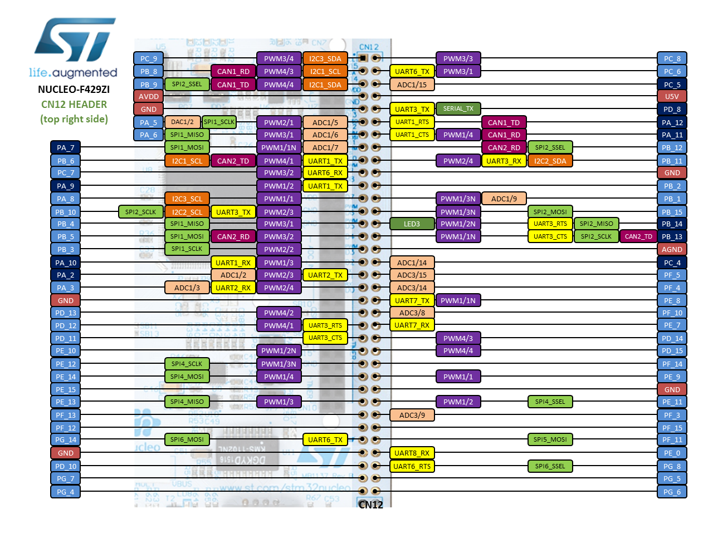

# C&DH Prototype

## Proposed BOM

| product | unit price | quantity |
|---|---|---|---|---|
| NUCLEO-F429ZI | [$33.64](https://www.mouser.ca/ProductDetail/STMicroelectronics/NUCLEO-F429ZI?qs=mKNKSX85ZJcE6FU0UkiXTA==) | 2 | false |
|   |   |   |   |   |

## Options considered

STM32F427/F437 - in general the eval and development boards are reaching EOL

1. STM32437I-EVAL - not active/large lead time/expensive
2. [MIKROE-1793](https://www.mouser.ca/ProductDetail/MikroElektronika/MIKROE-1793?qs=sGAEpiMZZMv0WPLDnYsI7xbdqJWuT%2fXOh%2fK9xwehWqDv1dKTXeDjHA%3d%3d) - $71.68 - low stock/expensive/low user base
3. [Netduino 3](https://www.mouser.ca/new/netduino/netduino-netduino-3/) - $73.14/$65.83 - EOL/expensive/clock rate is 168 MHz

STM32F429/F439 - much more popular/cost effective, almost the same as F427/F437

1. [NUCLEO-F429ZI](https://www.mouser.ca/ProductDetail/STMicroelectronics/NUCLEO-F429ZI?qs=%2fha2pyFaduj0LE%252bzmDN2WGl1unv%2f%252b4TgEmtLBne8iOGM77Cz8cQcdQ%3d%3d) - $33.64
2. [STM32F429I-DISC1](https://www.mouser.ca/ProductDetail/STMicroelectronics/STM32F429I-DISC1?qs=%2fha2pyFaduj7d0PgcNr%252bi52JmJP4Z3J6XQdJRi%252bIQeg93CGUmKsCjg%3d%3d) -  $43.74

## Board Selection Rationale

Two prototype boards are ideal, for the purpose of implementing over real CAN bus and mocking the peripherals over real serial connections.

The Endurosat OBC Type II has two options: an ARM Cortex M4 or an ARM Cortex M7 processor architecture. The worst case performance would be the Cortex M4 core, as it is the older generation of processor out of the two. The M4 is a 180 MHz processor while the M7 is a 216 MHz processor.

In the electrical characteristics section, the processor listed is the STM32F427. The features of this processor are listed [here](https://www.st.com/en/microcontrollers/stm32f427-437.html?querycriteria=productId=LN1789). The STM32F4 series has 8 different product lines for different applications, listed [here](https://www.st.com/en/microcontrollers/stm32f4-series.html?querycriteria=productId=SS1577).

The options for prototyping on STM32 boards are:

1. ST Nucleo Series
2. STM32F4 Discovery Boards
3. STM32F4 Evaluation Kits
4. 3rd party/ bespoke manufacturers

For [evaluation kits](https://www.st.com/en/evaluation-tools/stm32-mcu-eval-boards.html?querycriteria=productId=LN1199), the STM32437I-EVAL is not active and would have a large lead time/be very expensive. There does not seem to have been any other eval boards of the F437/F437 product line.

For [discovery kits](https://www.st.com/en/evaluation-tools/stm32-mcu-discovery-kits.html?querycriteria=productId=LN1848), there  are not any that implement the F427/F427, but there is the STM32F429I-DISC1 for the F429.

For the [Nucleo series](https://www.st.com/resource/en/data_brief/nucleo-f429zi.pdf), there are also not any that target the STM32F427. However, the NUCLEO-F429ZI targets the STM32F429, which may be the closest cost effective option. 

## Feasibility of using NUCLEO-F429ZI

The differences listed are:
* STM32F429 has an LCD-TFT display controller
* STM32F429 lacks a serial audio interface (I2S)
* STM32F429 is less performant/consumes more power

Information on the LCD-TFT controller may be found here:
1. [product description](https://www.st.com/en/microcontrollers/stm32f429-439.html?querycriteria=productId=LN1806)
2. [training slides](https://www.st.com/content/ccc/resource/training/technical/product_training/group0/3f/7b/af/97/88/ba/48/33/STM32F7_Peripheral_LTDC/files/STM32F7_Peripheral_LTDC.pdf/_jcr_content/translations/en.STM32F7_Peripheral_LTDC.pdf)

The controller may be switched completely off. The other peripherals seem to be suitable for demonstrating CAN, SPI, and USB interfaces (identical to a similar pin count on F427 or F437):
* 3x I2C
* 1 USB
* 6x SPI
* 4x USART/UART
* 2x CAN

RS-422 and analog peripherals will be more difficult to model on the vast majority of MCUs, so this is not necissarily a cause for concern. The most important peripheral for demonstration is the CAN bus.

### CN8 Interfaces

### CN7 Interfaces

### CN11 Interfaces

### CN12 Interfaces

## Tools for NUCLEO-F429ZI

1. [STM32CubeF4 BSP](https://www.st.com/content/st_com/en/products/embedded-software/mcus-embedded-software/stm32-embedded-software/stm32cube-mcu-packages/stm32cubef4.html)
2. IDEs: GCC based, IAR, Keil, ARM mbed 
3. [Example of freeRTOS usage with STM32F4 on STM32F407ZG](https://www.freertos.org/FreeRTOS-for-STM32F4xx-Cortex-M4F-IAR.html)

